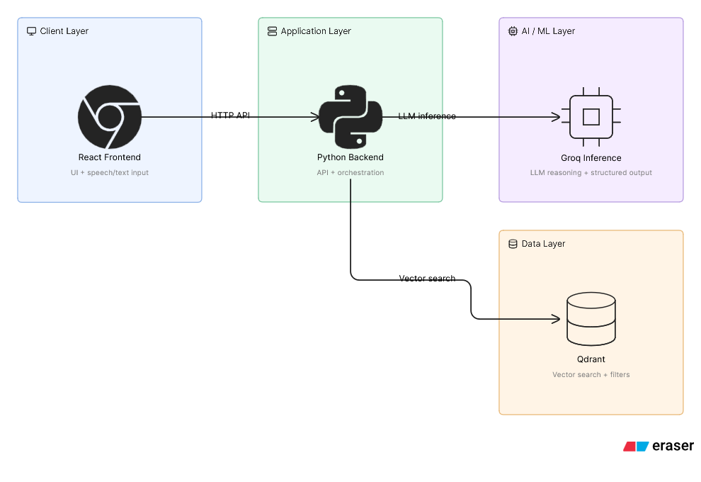
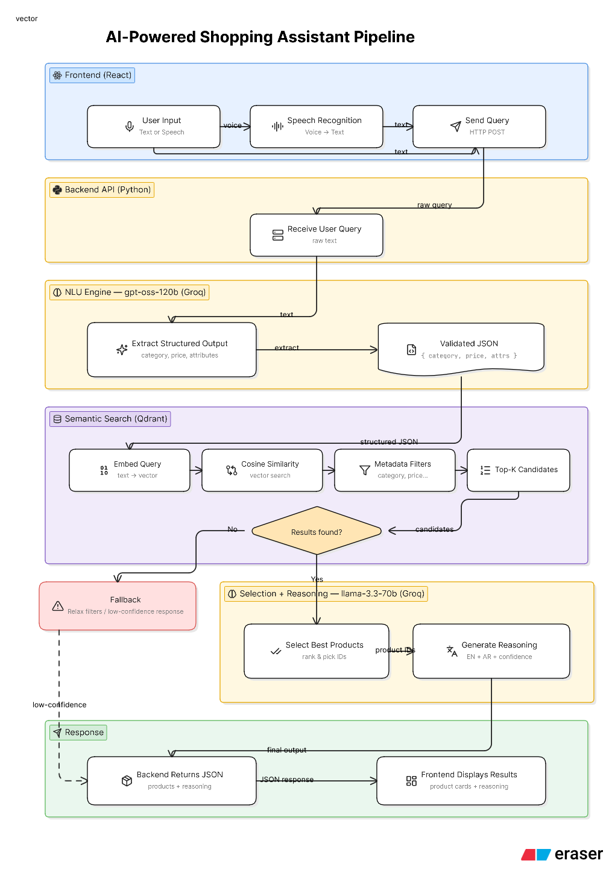

# Cartostrophe 🛒✨

An intelligent shopping assistant for mothers, designed to convert voice memos and natural language queries into a curated shopping cart. Developed as part of an internship assignment for **Mumzworld**.

## 🚀 Overview

Cartostrophe (a play on "Cart" and "Catastrophe"—because shopping for kids can be chaotic!) uses advanced Natural Language Understanding (NLU) and Retrieval-Augmented Generation (RAG) to help mothers find exactly what they need. Whether it's "organic skincare for a 2-year old" or "a portable booster seat for travel," the assistant filters through the catalog and recommends the best matches with reasoning in both English and Arabic.

---

## 🏗️ Architecture



The system follows a modern AI application stack:
-   **Frontend:** React (TS) + Vite + Tailwind CSS.
-   **Backend:** FastAPI (Python) + LangChain.
-   **Vector Database:** Qdrant (for semantic search).
-   **LLM:** Groq (GPT-OSS/Llama 3) for NLU and Selection.
-   **Embeddings:** Sentence-Transformers (`paraphrase-multilingual-MiniLM-L12-v2`).

Flowchart visualizing the search process:



---

## 🛠️ Setup Instructions

### Option 1: Setup with Docker

Ensure you have [Docker](https://www.docker.com/) and [Docker Compose](https://docs.docker.com/compose/) installed.

1.  **Clone the repository:**
    ```bash
    git clone https://github.com/shravanasati/cartostrophe.git
    cd cartostrophe
    ```

2.  **Configure Environment Variables:**
    Create a `.env` file in the root directory 
    ```env
    GROQ_API_KEY=your_groq_api_key_here
    ```

	You can obtain a Groq API key from [here](https://console.groq.com/keys).

3.  **Run with Docker Compose:**
    ```bash
    docker compose up --build
    ```
    -   Frontend: [http://localhost:8080](http://localhost:8080)
    -   Backend: [http://localhost:8000](http://localhost:8000)
    -   Qdrant: [http://localhost:6333](http://localhost:6333)

---

### Option 2: Setup without Docker

#### Prerequisites:
-   Python 3.12+ (managed by `uv` is recommended)
-   Node.js & `pnpm`
-   Qdrant instance running locally (or via Docker: `docker run -p 6333:6333 qdrant/qdrant`)

#### 1. Backend Setup
```bash
cd backend
uv sync
# Set your GROQ_API_KEY in .env (inside backend folder)
uv run fastapi dev main.py
```

#### 2. Frontend Setup
```bash
cd frontend
pnpm install
# Ensure .env has VITE_API_URL=http://localhost:8000
pnpm dev
```

---

## Usage

Once both frontend and backend are running, open the AI assistance pane and type or speak your query in English or Arabic. The relevant products will be searched and added to your cart.

You can run the `test_queries.py` script after starting the backend and view results of both NLU extraction and RAG search for queries in both English and Arabic.

```
uv run test_queries.py
```

You can also run the evals yourself using:

```
uv run evals.py
```

---

## 📊 Evaluation Results

The system was evaluated against a "golden dataset" of queries to ensure accuracy in filtering and recommendation.

### Evaluation Summary 
-   **Total Queries:** 14
-   **Successful:** 14
-   **Average Recall@3:** 0.8353
-   **Average NDCG@3:** 0.6217

### Behavioral Heuristics 
-   **Category Match:** 100.00%
-   **Target Customer Match:** 100.00%
-   **Price Max Match:** 100.00%
-   **Min Age Match:** 100.00%
-   **Attributes Match:** 85.71%

---

## ✨ Features Implemented

The following features were implemented based on the Mumzworld Track A assignment:

-   **Semantic Search & RAG:** Uses vector embeddings to find products that match the intent of the query, not just keywords.
-   **Strict Filtering (NLU):** Extracts constraints (category, age, price, target customer) from natural language and applies them as hard filters in the vector database.
-   **Bilingual Support:** Provides reasoning for product selection in both **English** and **Arabic**, catering to the regional demographic.
-   **Real-time Shopping Cart:** Users can seamlessly add recommended products to their cart.
-   **AI Chat Interface:** A dedicated chat panel for natural conversation with the shopping assistant.
-   **Automated Data Ingestion:** Seeds the Qdrant vector store automatically from `dataset.json` on the first run.
-   **Evaluation Pipeline:** Includes scripts for generating golden datasets and running comprehensive evals (`evals.py`).
